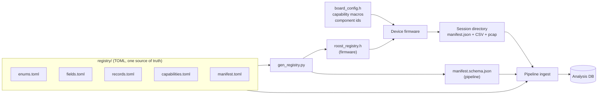

# Roost Logging Contract: Design Specification

One logging contract across the birdoscope ecosystem, so every device and the analysis pipeline can
be changed independently without going out of step.

This document is authoritative. It states the model and what an implementation has to do, and where
it and any other prose disagree, this file wins.

Authority runs in two tiers, and the higher one always wins:

1. `registry/*.toml` and the artifacts generated from them. Anything machine-checkable is settled
   here, and nothing below can override it. It cannot drift, because it is generated rather than
   maintained.
2. This document, for the rules a machine cannot check.

Every rule a device must follow is stated here, in full. A contract change that lands anywhere else
is drift.

## 1. The problem

Early development created several incompatible logging styles. The same measurement has
different names, the same name means different things, and there was no difference in logging between
a missed capture and a no attempt to capture.

This is an attempt to create a single implementation that's flexible enough to implement with minimal
configuration across devices. The contract replaces manual coordination with one source of truth that 
every side is generated from.

## 2. The model



Five stages, each with one job:

1. **Registry.** TOML. Declares vocabularies, fields, record types, capabilities, and manifest keys.
   Nothing else declares any of these.
2. **Generator.** Validates the registry, then emits a C header for firmware and a JSON Schema for
   the pipeline. Both carry the same registry hash.
3. **Device.** Compiles the generated header against its board's capability macros. What it can emit
   follows from that pair alone; no board writes a column list.
4. **Session.** A directory holding a manifest, one CSV per record type, and optionally a pcap.
5. **Pipeline.** Reads the manifest, validates it against the generated schema, and ingests rows by
   column name.

The through-line: every fact is declared once, in the tier that matches how often it changes, and
every downstream copy is generated rather than maintained.

## 3. Design choices

Each is stated as the rule an implementer follows.

### 3.1 Names and vocabulary

- A field name means one thing, in one unit, in one format, fleet-wide. Devices differ in which
  fields they populate, never in what a field means.
- A field whose value is computed rather than read has one computation, implemented once in
  `runtime/` and called by every device. Where a computation genuinely cannot be shared, the field
  definition states the derivation in normative terms.
- Devices may differ in how they obtain a value only where the contract says they may, and never
  silently. `rssi` under `obs_mode = scan` is the model: the measurement genuinely differs, the
  field definition says so, and a required column on every row tells a reader which one they hold.
  Undeclared divergence is the defect; declared divergence is a design choice.
- The rule above is not implied by any other rule here. The type system fixes how a value is
  rendered, never how it was arrived at, so two devices can satisfy every check and still write
  different bytes for one observation. A field whose rendering or derivation is not pinned by its
  definition is a field two implementations will disagree on.
- Record types never borrow each other's field names. `ble_obs` carries `device_name`, not `ssid`,
  and carries no `channel`.
- Enum values are registry-declared and closed. Firmware cannot emit an undeclared value, and the
  pipeline errors rather than coercing one.
- A vocabulary shared by two record types can be narrowed per record, so `ble_oui` cannot land on a
  Wi-Fi row.
- MACs are lowercase and colon-separated, normalized at the write path.
- A frame's addresses are recorded by position, never by role: `addr1`, `addr2`, `addr3`. A device
  writes what the frame carried and the pipeline derives roles from type and subtype. A role name
  varies per frame, so it cannot be a column name, and a column populated on only some branches is
  indistinguishable from one with no producer.

### 3.2 What earns a column

- A value the pipeline can rederive from data retained on the same row does not get a column. A
  field earns one when it records something observed that would otherwise be lost. Per-fix
  positional accuracy is the worked example: `hdop` is on the row and `gnss_cep_m` is in the
  manifest, so a device computes no `accuracy_m` and the pipeline derives it, where the model can be
  improved retroactively instead of frozen at capture time.
- A set of attributes of one observed frame is fields on that frame's row, not a record type of its
  own. The registry settles this: the record types are the six in `records.toml`, and a device
  cannot name one that is not there.
- Per-row variation is a field. Session invariance is a manifest declaration. Piecewise-constant
  variation within a session is a `config_change` row.
- Same measurement in different units or reference points is none of those. Normalize in firmware.

### 3.3 Shape

- A capability, build flag, or storage tier may change which fields are populated. None of them may
  change which fields exist, what a field is named, what it measures, or its units.
- A device emits an order-preserving projection of the record's canonical field order. Absent column
  means uncapturable; present-but-empty means uncaptured.
- Runtime configuration changes values, never columns. A file's column set is fixed at creation and
  derives from capability.
- Position is referenced by `fix_seq`, not repeated onto every row. Every row carries
  `uptime_ms`, and the manifest carries the clock anchor. `uptime_ms` is the moment the
  observation happened, never the moment the row was written; on a device where one component
  observes and another writes, the timestamp travels with the observation.
- Every row carries `cap_component`, the device-scoped id of the component that produced it.

### 3.4 Containers and layout

- Per-row timestamped data is CSV. Contract and configuration are JSON. Raw octets are pcap.
- Every text field is RFC 4180 quoted, with embedded quotes doubled. Every C0 control byte, DEL, and
  every byte that is not part of a well-formed shortest-form UTF-8 sequence is encoded as `\xNN`,
  with a literal backslash doubled. Nothing is stripped, nothing raw can break framing, a text
  column is valid UTF-8, and the original octets are recovered by decoding. The escaping
  revision is `text_encoding_rev` in `manifest.toml`, folded into the registry hash, so two builds
  that encode differently cannot claim the same registry.
- A session is a directory; record type and version are in the filename.
- A raw capture file is declared in `files` alongside the CSVs, with `linktype`, `snaplen` and
  `timebase` in place of a record version and columns.

### 3.5 Versioning

- Versions are per record type over an additive field registry. Adding a field, adding a sensor, or
  a device starting to populate something are all non-breaking. Renaming, removing, or changing a
  field's meaning are breaking.
- Additive growth is identified by the registry hash the manifest carries, not by a version bump.
- Breaking is a cost, not a prohibition. A record version is the sanctioned home for one: the
  version is in the filename, ingest dispatches on it, and files already written stay readable
  under the version they declare. A change that needs it is proposed against the criterion in
  §3.2, that a column the pipeline can rederive from data retained on the same row does not earn a
  column, rather than avoided because the word breaking appears here.
- **A superseded version stays in the registry, marked `retired = true`.** That is the mechanism
  behind "files already written stay readable under the version they declare". Without it a consumer
  dispatching on `record` and `version` has nothing to dispatch to, and a field the newer version
  dropped has no type at all, so the promise above has no way to be kept. A retired record, and any
  field retired alongside it, is read-only: excluded from the generated header so no device can
  emit it, and excluded from the registry hash so retaining it never forces a reflash. Exactly one
  non-retired version of a record name may exist at a time and the generator rejects two. A retired
  block describes bytes already on a card, so it is never edited to match a later shape.
- **Status:** `wifi_obs` is at v2, the other five record types at v1, and none is frozen. No
  consumer's compatibility has been promised. Until a freeze is declared here, a well-argued new
  version is cheaper than carrying a field that should not exist. After it, this section governs
  unchanged.
- Freezing is a decision to record in this section, with a date and the consumer it is being
  frozen for. The condition for taking it is that a device outside this project, or an archive
  whose captures must stay readable without re-ingestion, depends on a record's shape.

## 4. The registry

| File | Holds | Notes |
|---|---|---|
| `enums.toml` | Closed vocabularies | 15 including `component_kind`, `obs_mode`, `detection_method` |
| `fields.toml` | Field definitions: type, unit, precision, `requires` | 48 live plus 1 retired. `requires` names the capabilities that could produce the field |
| `records.toml` | Record types: canonical field order, `required`, `restrict`, `version`, `requires` | 6 live plus 1 retired version |
| `capabilities.toml` | Capability names and their C macros | 10 today |
| `manifest.toml` | Manifest provenance keys, by tier | The contract half of the manifest is not declared here |

### 4.1 Record types

| Family | Type | One row per | Requires |
|---|---|---|---|
| Observation | `wifi_obs` | Received frame, or device present in a scan window | `wifi` |
| | `ble_obs` | Advertisement, or device present in a scan window | `ble` |
| Context | `gps_track` | GPS fix | `gnss` |
| | `config_change` | One runtime setting taking a new value, plus every setting at boot | none |
| Annotation | `operator_mark` | Operator button press | `operator_mark` |
| Device | `device_event` | Boot, clock anchor, storage failure, buffer full, shutdown | none |

`wifi_obs` and `ble_obs` are unions rather than nestings: no device's subset contains another's.
Scan mode gets `auth_mode` for free where promiscuous mode does not, and promiscuous mode reaches
the whole frame layer where scan mode never sees a frame.

### 4.2 Capabilities

`gnss`, `storage`, `wifi`, `wifi_promiscuous`, `wifi_scan`, `ie_parse`, `ble`, `ble_promiscuous`,
`target_match`, `operator_mark`.

Two properties worth stating because they are not obvious from the list:

- **`storage` gates everything.** `ROOST_EMITS_<REC>` is the record's own gate AND `ROOST_CAP_STORAGE`.
  A build with no storage emits no files at all, rather than emitting headers it cannot write.
- **Gating is OR, not AND.** `auth_mode` requires `wifi_scan` or `ie_parse`. A conjunction is
  expressed by defining a capability that already implies its parts.

There is deliberately no capability for band reach. That is a per-component fact and lives in the
manifest's `components`, because one device-level macro cannot describe a build where one radio is 5
GHz only and another reaches both.

### 4.3 Manifest tiers

| Tier | Where it lands | Test |
|---|---|---|
| Registry | The field definition, never in a log | Invariant across every capture the fleet will take |
| Build | Manifest, from a compiled descriptor | Invariant for this binary on this board |
| Session | Manifest, written at capture | Invariant for this capture, not the next |
| Runtime | `config_change` rows, not the manifest | Can change mid-capture |

Runtime-tier keys are declared in `manifest.toml` alongside the rest, so each knob is defined once,
and the generator routes them into `config_change`'s `setting` vocabulary rather than into the
manifest schema. One definition, destination chosen by tier.

## 5. Generator contract

`tools/gen_registry.py`. Three modes: emit the header (`--out`), emit the schema (`--schema-out`),
and verify the checked-in artifacts still match (`--check`).

### 5.1 What it validates

Every one of these is an error, never a warning:

- A field referencing an undefined enum, or naming an enum while not being an enum.
- A record referencing an undefined field, or a `restrict` on a non-enum field, or a restricted
  value outside the vocabulary.
- A required field gated on a capability the record itself does not require, which would make the
  record unemittable on some builds for a reason the record never states.
- A manifest key duplicated across sections, of unknown type, or referencing an undefined enum.
- A `struct_list` with no items, an item of unknown type, a duplicate item name, or `items` on a key
  that is not a `struct_list`.
- A section declaring a tier other than build, session, or runtime.

A field no record references is reported but not fatal, since a placeholder for a record type not
yet written is legitimate.

### 5.2 What it emits for firmware

`generated/roost_registry.h`, header-only, no allocation, safe on an MCU.

| Symbol | Purpose |
|---|---|
| `ROOST_REGISTRY_HASH` | Semantic fingerprint. Goes into the manifest |
| `RoostRecord`, `RoostFieldMask`, `ROOST_F(i)` | Record enum and field-set bitmask |
| `ROOST_<REC>_<FIELD>` | Canonical index of each field |
| `ROOST_<REC>_REQUIRED_MASK` | Fields every emitter of this type must populate |
| `ROOST_EMITS_<REC>` | Whether this build emits the record at all |
| `ROOST_<REC>_CAPABLE_MASK` | Fields this build can populate, computed by the preprocessor |
| `ROOST_<REC>_EXCLUDE` | Board-declared opt-out, defaults to 0 |
| `ROOST_<REC>_COLUMNS_MASK` | `CAPABLE & ~EXCLUDE`. Both operands preprocessor constants |
| `roostRecordName()`, `roostRecordVersion()`, `roostRecordFieldCount()`, `roostFieldTypeOf()` | Record and field metadata accessors |
| `roostHeader()`, `roostFieldName()`, `roostFileName()` | Header and filename rendering |
| `roostMaskSatisfiesRequired()`, `roostValueAllowed()`, `roostEnumName()` | Runtime checks and enum lookup |
| `RoostRow`, `roostRowBegin()`, `roostRowSet*()`, `roostRowFinish()` | Row assembly. The only supported way to write a row |
| `roostRowSetEnumByName()` | Resolves a device's existing name string against the registry vocabulary |
| `RoostFileDecl`, `roostFileDeclValid()`, `roostManifestFiles()`, `roostManifestPcapFile()` | Manifest contract half |
| `RoostTimebase`, `ROOST_TEXT_ENCODING_REV` | A raw capture's clock, and which revision of the text escaping rule (§3.4) this build encodes under |
| `RoostComponent`, `roostComponentId()`, `roostComponentKind()`, `roostComponentPart()`, `roostComponentBandMask()` | The board's component declaration, expanded from `ROOST_COMPONENTS` |
| `roostManifestComponents()`, `roostComponentsValid()` | Renders the manifest's `components`; checks ids are present and distinct |

### 5.3 What is enforced at compile time

The point of generating a header rather than a config file is that contradictions become build
failures on the developer's machine instead of bad data on a card in the field.

| Contradiction | How it fails |
|---|---|
| A capability left undeclared | `#error`. Never defaults to 0, because a silently shrinking mask is a capture quietly recording less than it could |
| Components left undeclared | `#error`. A device that cannot say what it is made of cannot say which part produced a row |
| A misspelled band in a component declaration | Undefined macro. Band flags are generated from the `band` vocabulary |
| A row naming a component by string | Unexpressible: row writers name one by `RoostComponent` identifier |
| A board excluding a required field | Negative-size array typedef, guarded on `ROOST_EMITS_<REC>` |
| Computing a column set from runtime state | Unexpressible: both operands of `COLUMNS_MASK` are preprocessor constants |
| Emitting fields out of canonical order | Refused at runtime and voids the row; a passed column cannot be revisited |
| A row whose fields do not line up with its header | `tests/test_row_alignment.cpp`, exhaustively over every record and emptiness pattern |
| A setter of the wrong type for a field | Refused: field types come from the registry |
| Emitting an undeclared enum value | Unrepresentable: vocabularies arrive as C enums |
| A hand-edited generated header | `--check` regenerates and diffs, run by `tests/run.sh` |

### 5.4 The semantic hash

The hash fingerprints the parsed structure, not the file bytes, so reformatting or editing a
description does not churn it and force a needless reflash. It covers enum names and values, field
name/type/enum/unit/precision/requires, record name/version/fields/required/restrict/requires,
capability names and macros, and each manifest key's name, type, enum and item shape.

A change that alters meaning moves the hash. A change that does not, does not.

## 6. Emitter contract

What firmware must do, in the order it must do it.

### 6.1 At build

0. Import this library as a PlatformIO dependency rather than copying the generated header. There is
   one header for every device: it is a pure function of the registry and takes no board input, so
   nothing about it is per-device. A device pins a registry version, so a capture whose
   `registry_hash` lags the current registry is expected rather than a fault.
1. Declare every capability in one board header. Undefined is a compile error.
2. Declare `ROOST_COMPONENTS` in the same header: one entry per physical capture component, giving
   its identifier, id string, kind, part, and band reach. Undefined is a compile error.
3. Include `roost_registry.h`. Do not restate any column list, header string, filename, or component
   fact: all of them are rendered from the two declarations above.

### 6.2 At session start

1. Create the session directory.
2. Build a `RoostFileDecl` per emitted record type, with `columns` = `ROOST_<REC>_COLUMNS_MASK` and
   `capable` = `ROOST_<REC>_CAPABLE_MASK`.
3. Call `roostComponentsValid()`. A failure is a `device_event`, not a silent start: it is the one
   component check the preprocessor cannot make, since it cannot compare string literals.
4. Create every declared file and write its header, including the ones for record types this session
   may never observe. A declared file is never absent, and a record type that captured nothing is a
   header with no rows under it. How a device does this is its own business; the state the
   directory ends up in is not.
5. Write the manifest: fill a `RoostSessionInfo`, call `roostSessionJson()`, and write the bytes it
   returns. A return of 0 means it did not fit, and nothing is written. See section 7.
6. Write one `config_change` row per runtime setting with its boot value, so the file is
   self-contained from its first row.
7. Write a `device_event` with `event_kind = boot`.

Steps 1 and 4 happen before the clock is known, on any device whose time arrives from a GNSS fix or
a network. That is the normal case, not an edge case, and the rules below govern what the arrival of
the anchor may then do:

- **Provisional naming.** Name the session at boot, with a name unique per boot. Never a fixed name
  that successive boots append to. A shared name makes rows unattributable rather than merely
  misnamed, because nothing in the artifact says where one boot ended and the next began.
  Derive the provisional name by probing for the first unused one, and refuse to start when the
  space is exhausted rather than falling back to a shared last resort, which would put two boots in
  one session.
- **Rename, never restart.** When the anchor lands the container is renamed. Every file is the
  same file afterwards: no header is re-emitted, no capture-format global header is duplicated, and
  each record type stays one continuous file across the anchor rather than a pre/post pair that a
  reader has to stitch. Splitting at the anchor strands everything captured before it.
- **Container defined.** The container is whatever carries session identity on that device: a
  directory, a filename, or both. A device with one file renames that file; a device with a
  directory of files renames the directory. What is fixed is that the rename is a naming operation
  and never a data one.
- **A failed rename is not a failed capture.** Keep the provisional name and carry on: the manifest
  records which container the session is in either way, so the only thing lost is a cosmetic name.

Nothing here needs the rows to change. Pre-anchor rows carry `uptime_ms` with an empty
`timestamp_utc`, and the manifest's anchor triple (§3.3) places them retroactively.
The naming rule exists so the artifact those rows live in survives the anchor intact.

### 6.3 Per row

Build every row through `RoostRow`. It is the only supported way to write one, and it owns the rules
that should be implemented consistently:

1. `roostRowBegin(&r, buf, cap, record, ROOST_<REC>_COLUMNS_MASK)`.
2. One setter per value, naming the field by its canonical index. Setters are typed to the field's
   class, so writing an integer into a text column is refused rather than accepted.
3. `roostRowFinish(&r)`, which pads the declared columns never set, verifies every required one was
   populated, and returns 0 with an emptied buffer if anything was violated.

What that provides without the device having to remember it: canonical order, since a column already
passed cannot be filled in afterwards; empty rather than sentinel for absent values; RFC 4180 quoting
with CR/LF preserved; lowercase MACs; float precision taken from the field definition rather than the
caller; and per-record enum restriction.

Enum columns can also be set from the wire spelling, with `roostRowSetEnumByName()`. A device
reaching this contract usually has producers that already return name strings and other consumers of
those producers, so rewriting them to return roost enums would duplicate the vocabulary or break a
display. Resolving the name against the registry keeps one table. The setter is generated rather
than written per device, so every device agrees on what an unresolvable name does.

A name the vocabulary does not contain leaves the column empty and increments `unknownEnums` on the
row; it does not void the row. Names live in device code and cannot be checked at compile time, so
this is drift that will happen, and losing the field is proportionate where losing the observation
is not. On a required column the escalation is automatic and needs no special case: the column is
never written, so `roostRowFinish()` refuses. Read `unknownEnums` and surface it. An unexplained
empty column reads as "nothing to record" when the truth is "a producer and the registry have
drifted", which is the ambiguity this contract exists to remove.

Setting a field this device does not declare is a benign no-op, which is what lets one row-building
code path serve every device in the fleet. `uptime_ms` and `cap_component` are required on every
record type, so a row omitting either does not finish.

`uptime_ms` is the fleet-wide fallthrough, and this is the rule it exists to make possible: a row
whose wall-clock time is not yet known leaves `timestamp_utc` empty and carries `uptime_ms`
alone. It never carries a stand-in. `timestamp_utc` is required on none of the six record types
precisely so that this is expressible, and the manifest's anchor triple (§3.3) is what makes such a
row retroactively placeable as `anchor_unix + (uptime_ms - anchor_uptime_ms)` rather than dropped at
import.

On a device with more than one processor, `uptime_ms` is on the timebase of whichever component
owns storage and writes the clock anchor; the others express their own clock on it, and decline to
emit rows until they can. Multi-processor devices are common, so this is not an exception
case.

A raw capture follows the same rule with the one difference its format forces. A pcap record has a
single timestamp field, so it cannot carry a monotonic value beside a wall-clock one; it declares
which of the two it holds, in the manifest's `timebase`, and a device without a clock from its first
frame writes `boot` and is placed by the same anchor arithmetic. Switching mid-file to wall clock on
first fix is the one thing the key cannot describe, because a declaration covers the whole file.
`timebase` says what the timestamps mean and never whether the session's clock anchored.

Stated generally: a declared column never
holds a placeholder. Not `"<millis>ms"` in a timestamp, not `0.000000` in a coordinate, not a
fabricated accuracy, not a sentinel count. Absence is empty, and what the absence means is either
the record's own business (`position_source`) or the manifest's (`capable_unrecorded`). A device
that cannot express absence any other way is missing a field, not in need of a magic value.

### 6.4 On change and on failure

- A runtime setting changing writes one `config_change` row. A setting re-applied to its existing
  value writes nothing.
- A write failure, buffer overflow, or clock anchor writes a `device_event` and increments the
  counter that reaches the manifest.
- The manifest is rewritten on a snapshot cadence, so a session that loses power still leaves the
  most recent counters.

### 6.5 Forbidden

- Two layouts for one record type, selected by a build flag.
- A value standing in for absence.
- A column whose meaning depends on another column's value.
- Position inlined onto observation rows alongside `fix_seq`. Two representations will disagree.
- A periodic record written to show the device is still running. There is no heartbeat record and no
  timed counter snapshot: transitions are `config_change` rows and degradation is a `device_event`
  carrying its own `uptime_ms`, `fix_seq` and `event_count`. An alive indicator is a display
  element, never a log row.
- Declaring a file the session does not create.

## 7. Session and manifest

Session format (pre-time anchor):

```
/{device shortcode}-{bootsequence}-{session}/
    manifest.json
    wifi_obs.v1.csv
    ble_obs.v1.csv
    gps_track.v1.csv
    config_change.v1.csv
    device_event.v1.csv
    frames.pcap
```

Session format (post-anchor):

```
/{device shortcode}-{day}-{month}-{year}-{session}/
    manifest.json
    wifi_obs.v1.csv
    ble_obs.v1.csv
    gps_track.v1.csv
    config_change.v1.csv
    device_event.v1.csv
    frames.pcap
```

The manifest has two halves, maintained differently:

- **Contract half** (`files`): which files the session produced, their record types, versions,
  columns, and `capable_unrecorded`. Rendered by generated code from the registry and the device's
  masks. Never hand-written, so there is no way to state a column list that disagrees with the
  header the device actually wrote. Every entry names a file that is present: an absent file would
  say "captured nothing" and "something went wrong" at once, and telling those apart would need a
  per-device rule about which records may be missing.
- **Provenance half**: what the device did rather than what it is. Key names are registry-declared,
  so two implementations cannot spell one fact two ways. Every key is present in every manifest; a
  device that cannot supply one writes null, which keeps a missing key unambiguously an error.

Both halves are rendered by `roostSessionJson()` in `runtime/roost_manifest.h`. A device supplies
facts and receives bytes; it does not spell a key, format a timestamp, decide what an absent value
renders as, or assemble a counter. Registry-declared key names only stop implementations spelling
one fact several ways if one piece of code does the spelling.

Two properties the renderer owns:

- **It renders whole or returns nothing.** A manifest that does not fit is not written at all. A
  truncated one asserts a file set and a column list the session does not have, and it fails
  validation for the entire capture rather than for the part that was cut.
- **Counters come from the writer, not the device.** `observations_written` is rows across the
  observation family, derived from each record's `family`; `storage_errors` is failed write and sync
  calls; `observations_dropped` is rows lost for any reason, including rows the builder refused. A
  device passes only the two figures the writer cannot know: observations its own filters suppressed,
  and observations lost before they reached the writer. A counter assembled by hand is a counter that
  can be wrong in a way indistinguishable from a quiet capture.

### 7.1 The four field states

This is the contract's central guarantee, and the reason the manifest exists at all.

| State | Where it shows | Meaning |
|---|---|---|
| Column present, value present | File | Captured |
| Column present, value empty | File | Uncaptured. Reachable, nothing to record |
| Column absent, field in `capable_unrecorded` | Manifest | Reachable by this hardware, not recorded in this configuration |
| Column absent, in neither list | Manifest | Uncapturable. This hardware cannot measure it |

`capable` must be a superset of `columns`. A declaration claiming to emit a column the hardware
cannot fill renders nothing rather than something plausible.

### 7.2 Components

`hardware.components` declares every capture component: `id`, `kind`, `part`, and `bands`. This is
the vocabulary `cap_component` on each row is validated against.

It is rendered by `roostManifestComponents()` from the board's `ROOST_COMPONENTS` declaration, not
hand-written. That matters most for `bands`, which is the immutable band reach of a radio: a
hand-typed value would be a constant describing hardware, maintained in a JSON writer, going stale
on the first board revision. Declared at compile time it cannot disagree with the board.

Only immutable facts appear. Antenna does not, because firmware cannot read what is attached and a
declared value would go stale on the first swap. Responsibilities do not, because what a component
is currently doing is runtime and rides on `config_change` keyed by the same id.

## 8. Ingest contract

1. **Dispatch by column name, never by position.** Declared column subsets are unimplementable
   otherwise.
2. **Version dispatch, three tiers, first hit wins, unknown is an error.** A session directory
   dispatches on its manifest's `record` and `version` per file. A loose file with no manifest
   dispatches on its filename. A legacy file with neither falls back to header-tuple matching.
3. **Validate the manifest** against the generated schema, then check what a schema cannot express:
   declared columns exist in the record *version* they name, sit in that version's canonical order,
   cover its required set, and match its filename. Resolve the definition by `(record, version)`,
   never by record name alone. A name resolves to more than one definition once a version is
   retired, and validating a v1 capture against the v2 shape rejects it for carrying a column that
   version legitimately had. A version the registry does not define at all is the error.
4. **Decode `\xNN` escapes in text fields** on read, restoring the captured bytes.
5. **Reject unknown enum values** rather than preserving or coercing them. Note this is the
   only genuine version fault. A capture whose `registry_hash` is older than the current registry is
   normal, because devices pin and growth is additive: identify it, do not warn on it.
6. **Validate `cap_component`** against the manifest's declared components. This is the one
   guarantee that moved from compile time to ingest time, because device-scoped ids cannot be a
   fleet-wide C enum.
7. **Resolve position by `fix_seq`**, joined on `(session, device, fix_seq)`. Never nearest
   timestamp within the session.
8. **Resolve configuration by time**: the state of a setting at time T is the last `config_change`
   row for that setting with `uptime_ms` at or below T. Always defined, because of boot rows.
9. **Group sessions into runs at import** by time overlap, with operator override. Devices in the
   field share no link and cannot agree on an identifier.
10. **Cross-check `obs_mode`** on rows against the interval `config_change` declares. Disagreement is
   a firmware bug, and is otherwise silent.

The legacy path survives unchanged. Files written before the contract must keep importing, so
filename routing and header-tuple matching become fallbacks rather than being removed.

## 9. Where each rule is enforced

The same rule enforced in two places is the drift this project removes, so each is enforced in
exactly one.

| Rule | Enforced at | By |
|---|---|---|
| Registry is internally consistent | Generation | `gen_registry.py` validation |
| Generated artifacts match the registry | Commit | `--check` in `tests/run.sh` |
| A board declares every capability | Firmware compile | `#error` |
| A board declares its components | Firmware compile | `#error` |
| A board does not exclude a required field | Firmware compile | Negative-size typedef |
| Columns do not derive from runtime state | Firmware compile | Preprocessor constants |
| Enum values are in vocabulary | Firmware compile, and ingest | C enum, and ingest rejection |
| Fields are emitted in canonical order | Row write | `RoostRow`: a passed column cannot be revisited |
| A setter matches the field's type | Row write | `RoostRow`, from the registry's field types |
| Text is RFC 4180 quoted, MACs lowercase | Row write | `roostRowSetText()`, `roostRowSetMac()` |
| Floats carry the field's declared precision | Row write | `roostRowSetFloat()`, from `fields.toml` |
| An enum value is legal on this record | Row write | `roostRowSetEnum()` via `roostValueAllowed()` |
| A name producer has drifted from the vocabulary | Row write | `roostRowSetEnumByName()` counts it in `unknownEnums` |
| Required fields are populated | Row write | `roostRowFinish()` returns 0 and empties |
| Header matches the manifest's column list | Neither: rendered from one source | `roostManifestFiles()` |
| Manifest is well-formed | Ingest | Generated JSON Schema |
| Columns are canonical and cover required | Ingest | `test_manifest.py`, then the loader |
| `cap_component` names a declared component | Ingest | Manifest component list |
| Every declared file exists | Ingest | `test_manifest.py`, run against a session directory |

## 10. Extending the contract

| To add | Do | Version impact |
|---|---|---|
| A field | Add to `fields.toml`, add to the record's `fields` in canonical position | None. Devices that do not declare it are untouched |
| An enum value | Add to `enums.toml` | Bumps every record using that enum |
| A record type | Add to `records.toml` with `requires`, `fields`, `required` | None to existing types |
| A capability | Add to `capabilities.toml`, gate the fields it produces | None, but every board's build breaks until it answers |
| A device | Add the library reference, then declare its capabilities and components. Everything else follows | None |
| A manifest key | Add to `manifest.toml` under the right tier | None |

Renaming or removing a field, or changing its meaning, units, or type, is the only breaking class.
Field identifiers are never reused for a different meaning.

Run `tests/run.sh` after any registry change. It validates, regenerates, diffs against the
checked-in artifacts, checks row alignment exhaustively, compiles the header against four board
profiles plus three negative cases, and validates the example manifest.

## 11. Status

The registry generates both artifacts, and the generated header compiles against every board profile
in `tests/`. No record type is frozen; section 3.5 governs when one becomes so.
